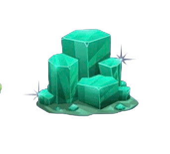
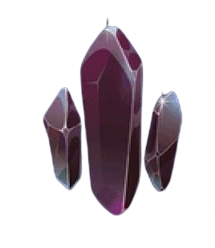

<html lang="en">
<head>
    <meta charset="UTF-8">
    <meta name="viewport" content="width=device-width, initial-scale=1.0">
    <title>Diamond Mind Memory Game</title>
    <link rel="stylesheet" href="style.css">
    <audio id="clickSound">
        <source src="click_sound.mp3" type="audio/mpeg">
        Your browser does not support the audio element.
    </audio>
</head>
<body>
    <header>
        <h1 class="title">Diamond Mind Memory Game</h1>
    </header>

    <main>
        <section class="game-container">
            

                <!-- Memory cards -->
                

                    
                    
                

                

                    
                    
                

                

                    
                    
                

                

                    
                    
                

                

                    
                    
                

                

                    
                    
                

                

                    
                    
                

                

                    
                    
                

                

                    
                    
                

                

                    
                    
                

                

                    
                    
                

                

                    
                    
                

                <!-- End of memory cards -->
            

        </section>

       

        <!-- Play Again Button outside the popup -->
        <button class="playAgainButton">Play Again</button>

        <!-- Background music -->
        <audio id="bgMusic" loop>
            <source src="background_music.mp3" type="audio/mpeg">
            Your browser does not support the audio element.
        </audio>

        <!-- Sound effect for popup -->
        <audio id="popupSound">
            <source src="popup-sound.mp3" type="audio/mpeg">
            Your browser does not support the audio element.
        </audio>

         <!-- Popup message -->
         

            

                <h2>Congratulations!</h2>
                
You've completed the game.

                <button class="playAgainButton">Play Again</button>
            

        

    </main>

    
</body>
</html>
